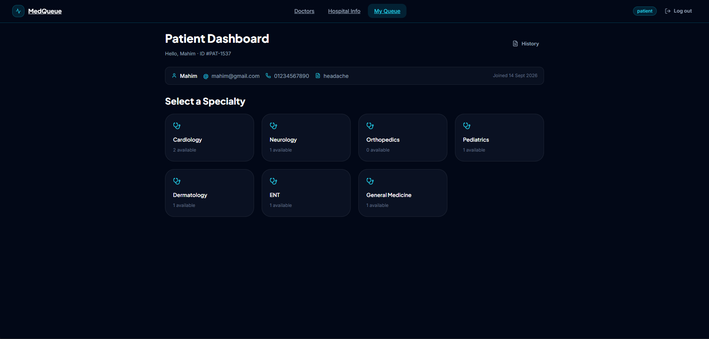
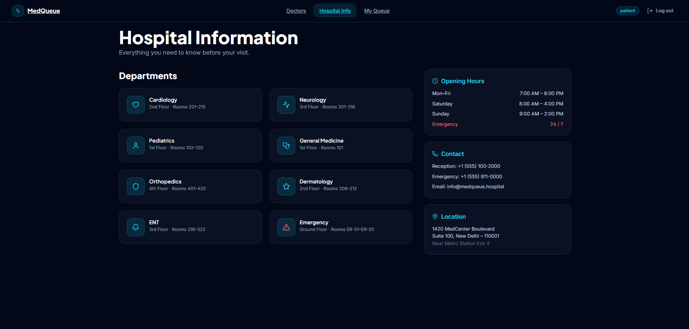
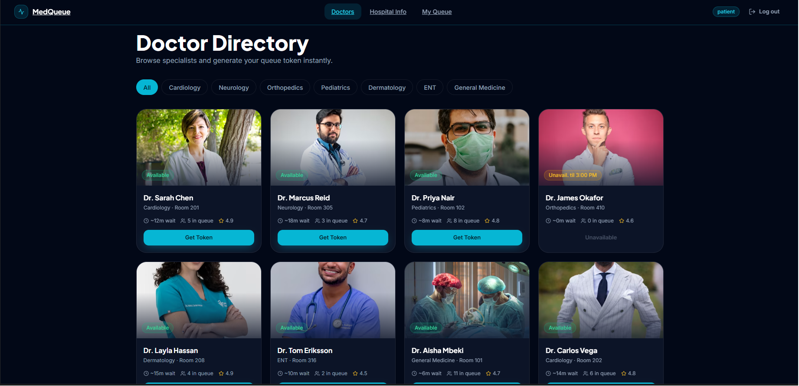
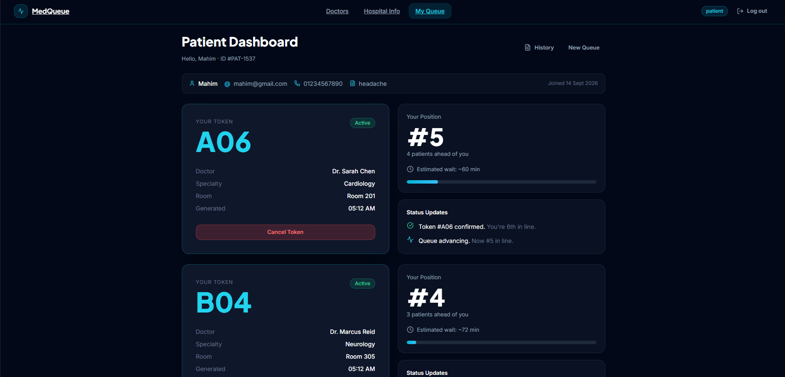
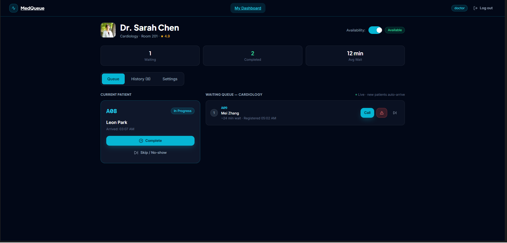
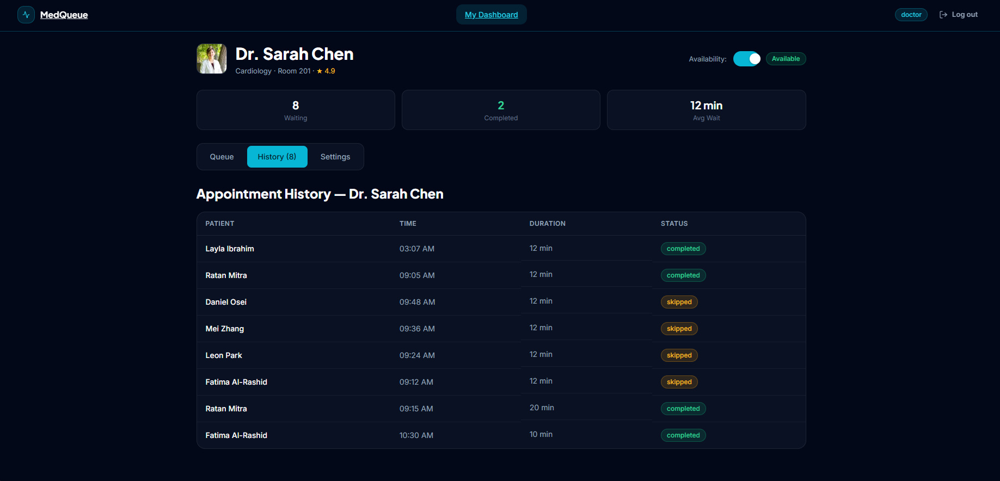
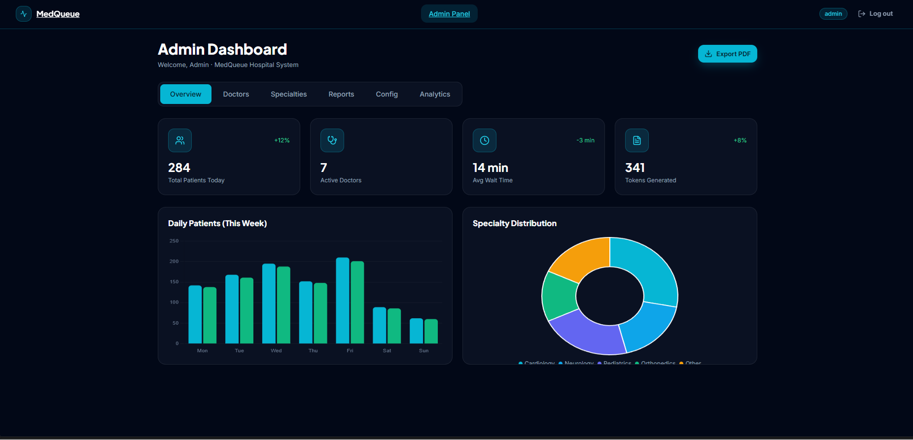
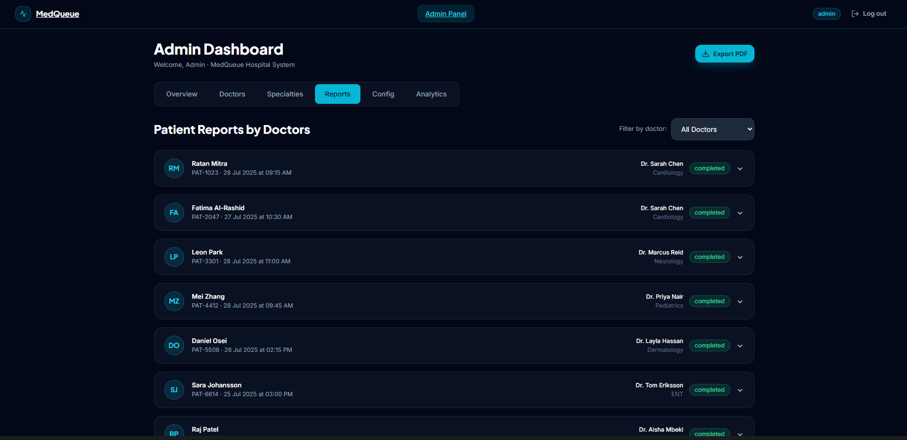
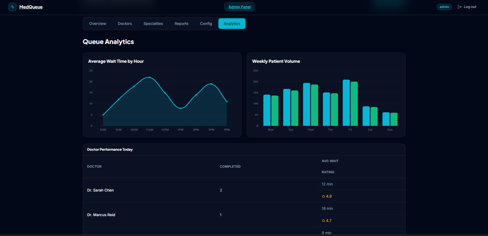

<div align="center">
  
# MedQueue

> A multi-page hospital queue management demo for patients, doctors, and administrators — built with plain HTML, CSS, and JavaScript.

[](https://developer.mozilla.org/en-US/docs/Web/HTML)
[](https://developer.mozilla.org/en-US/docs/Web/CSS)
[](https://developer.mozilla.org/en-US/docs/Web/JavaScript)
[](#known-limitations)
[](LICENSE)

</div>

## Table of Contents

- [Preview](#preview)
- [About](#about)
- [Features](#features)
- [Screenshots](#screenshots)
- [Tech Stack](#tech-stack)
- [Architecture](#architecture)
- [User Roles](#user-roles)
- [Prerequisites](#prerequisites)
- [Getting Started](#getting-started)
- [Project Structure](#project-structure)
- [Pages](#pages)
- [Data & Persistence](#data--persistence)
- [Known Limitations](#known-limitations)
- [Contributing](#contributing)
- [License](#license)
- [Contact](#contact)

<div align="center">

## Preview
| Home Page|
|-----------|
|  |

</div>

## About

MedQueue is a browser-based hospital queue management system that lets patients browse doctors, receive digital queue tokens, and track their position; lets doctors manage a live waiting queue during a shift; and gives administrators tools to manage doctors, specialties, and view sample patient reports.

The application is a **frontend-only prototype**. It uses separate HTML pages (not a single-page app framework), native ES modules for JavaScript, and `localStorage` to share state between pages. There is no server-side backend, database, or build step in this repository.

## Features

### Public (Guest)

- **Landing page** — hero section, animated stats, feature overview, doctor highlights, patient flow walkthrough, and call-to-action links
- **Doctor directory** — browse doctors, filter by specialty, and start the token flow (`Get Token` redirects to Register if not logged in as a patient)
- **Hospital information** — departments, opening hours, contact details, and location (static content)
- **Login** — role-based sign-in for Patient, Doctor, or Admin (demo authentication; see [Known Limitations](#known-limitations))
- **Register** — two-step patient registration (basic info, optional medical condition)

### Patient

- **Queue token booking** — select specialty → choose doctor → generate a token with position and estimated wait
- **Live queue tracking** — view token details, position, progress bar, and status updates; position advances on a timer while tracking
- **Token management** — cancel active tokens; switch between queue, history, and new booking flows
- **Appointment history** — table of past and active tokens for the current browser session
- **Profile strip** — displays name, email, phone, condition, patient ID, and join date

<div align="center">
  
#### Screenshots

| Dashboard |
|-----------|
|  |

| Hospital Info |
|---------------|
|  |

| Doctor List |
|-------------|
|  |

| Queue Token |
|-------------|
|  |

</div>

### Doctor

- **Queue management** — view current in-progress patient and waiting queue; call next, complete, skip, or flag as emergency
- **Simulated live arrivals** — new waiting patients are added automatically on an interval while the doctor is marked available
- **Session persistence** — queue state survives page reloads and navigation via `localStorage`
- **Availability toggle** — mark available or unavailable (stops simulated arrivals when unavailable)
- **Appointment history** — session completions plus seeded sample reports for the logged-in doctor
- **Availability settings** — configure start/end times and optional unavailable blocks (saved to the doctor session in `localStorage`)

<div align="center">
  
#### Screenshots

| Dashboard |
|-----------|
|  |

| Patient History |
|-----------------|
|  |

</div>


### Admin

- **Overview dashboard** — summary stat cards and charts (daily patients, specialty distribution)
- **Doctor management** — add, edit, and remove doctors; set specialty, room, availability, average wait, and photo
- **Specialty management** — add, rename, and remove specialties (renaming updates linked doctors)
- **Patient reports** — browse expandable seeded consultation reports; filter by doctor
- **Token configuration** — UI for queue limits and emergency priority (display only; changes are not persisted)
- **Analytics** — wait-time and weekly volume charts; doctor performance table
- **Export** — triggers the browser print dialog (`window.print()`)

<div align="center">
  
#### Screenshots

| Dashboard |
|-----------|
|  |

| Patient Report |
|----------------|
| |

| Queue Analytics |
|-----------------|
| |

</div>


## Tech Stack

| Layer | Technology | Notes |
|-------|------------|-------|
| Markup | HTML5 | One folder per page (`*.html`) |
| Styling | CSS3 | Shared design system in `Frontend/shared/style.css` plus page-specific CSS |
| Scripting | JavaScript (ES Modules) | `<script type="module">` on every page; no bundler |
| Icons | [Lucide](https://lucide.dev/) | Loaded from `unpkg.com` via UMD script |
| Charts | [Chart.js 4](https://www.chartjs.org/) | Admin dashboard only; loaded from `cdn.jsdelivr.net` |
| Fonts | [Plus Jakarta Sans](https://fonts.google.com/specimen/Plus+Jakarta+Sans), [Inter](https://fonts.google.com/specimen/Inter) | Google Fonts |
| Images | [Unsplash](https://unsplash.com/) | Doctor portrait URLs in seed data and cards |
| State | `localStorage` | Session, doctors, specialties, tokens, doctor sessions |
| Seed data | `Frontend/shared/data.js` | Doctors, specialties, reports, analytics mock data |
| Build tools | None | No `package.json`, npm scripts, or compilation step |
| Backend | None (in repo) | `Backend/` directory exists but is empty |

## Architecture

MedQueue is a **static multi-page website**. Each screen is a real HTML file with a full page load. Shared UI, data access, and navigation live in `Frontend/shared/`. Cross-page state is written to the browser's `localStorage` because in-memory JavaScript variables do not survive navigation.

```text
Browser
  │
  ├── Static HTML pages (homepage, doctors, dashboards, …)
  │     └── Page JS (ES module) — renders UI, handles clicks/forms
  │
  ├── shared/
  │     ├── store.js  ──► localStorage (user, doctors, tokens, sessions)
  │     ├── data.js   ──► seed / mock data (initial doctors, reports, charts)
  │     ├── nav.js, ui.js, doctorCard.js, icons.js, tilt.js
  │     └── style.css ──► shared design tokens and components
  │
  └── External (CDN)
        ├── Lucide icons
        ├── Chart.js (admin pages)
        ├── Google Fonts
        └── Unsplash doctor photos
```

There are **no `fetch()` calls**, REST endpoints, WebSockets, or database connections in the current codebase.

## User Roles

| Role | Authentication | Nav access | Main capabilities |
|------|----------------|------------|-------------------|
| **Guest** | None | Doctors, Hospital Info, Log in, Register | Browse public pages; cannot access dashboards |
| **Patient** | Login or Register | Doctors, Hospital Info, My Queue | Book tokens, track queue, view history |
| **Doctor** | Login (Doctor tab) | My Dashboard only | Manage queue, toggle availability, view history |
| **Admin** | Login (Admin tab) | Admin Panel only | Manage doctors/specialties, view reports and analytics |

**Doctor login:** use a hospital email mapped in `DOCTOR_EMAILS` (for example `sarah.chen@medqueue.hospital`). The app resolves the doctor profile from that email. Any password is accepted in this demo.

**Admin login:** any email and password are accepted; the profile is set to `Admin`.

Protected dashboards call `requireRole()` in `Frontend/shared/store.js`, which redirects unauthenticated or wrong-role users to `login/login.html`.

## Prerequisites

- A **modern browser** (Chrome, Firefox, Edge, or Safari)
- A **local static HTTP server** — required because pages use ES modules, which browsers block over the `file://` protocol
- An **internet connection** for CDN-delivered fonts, Lucide, Chart.js, and Unsplash images

Optional: [Python 3](https://www.python.org/) (built-in `http.server`) or [Node.js](https://nodejs.org/) (for `npx serve`).

## Getting Started

### 1. Clone the repository

```bash
git clone https://github.com/m09xd/MedQueue.git
cd MedQueue
```

### 2. Start a local server from the `Frontend` directory

**Python (Windows / macOS / Linux):**

```bash
cd Frontend
python -m http.server 8000
```

On some systems the command is `python3` instead of `python`:

```bash
cd Frontend
python3 -m http.server 8000
```

**Node.js (alternative):**

```bash
cd Frontend
npx serve .
```

**VS Code:** use the [Live Server](https://marketplace.visualstudio.com/items?itemName=ritwickdey.LiveServer) extension and open `Frontend/index.html`.

### 3. Open the app

Visit [http://localhost:8000](http://localhost:8000) (or the port shown by your server).

`Frontend/index.html` redirects to `homepage/homepage.html`.

> **Why not double-click an HTML file?** Each page loads JavaScript with `<script type="module">`. Browsers enforce CORS on module scripts and will not load them from `file://` URLs. A local HTTP server is required.

### 4. Try the demo flows

| Goal | Steps |
|------|-------|
| Register as patient | Homepage → **Register** → complete both steps |
| Book a token | Log in as patient → **My Queue** → pick specialty and doctor, or use **Doctors** → **Get Token** |
| Log in as doctor | **Log in** → **doctor** tab → email `sarah.chen@medqueue.hospital` → any password |
| Log in as admin | **Log in** → **admin** tab → any email and password |

## Project Structure

```text
MedQueue/
├── Frontend/                 # Complete web application (serve this folder)
│   ├── index.html            # Redirects to homepage/homepage.html
│   ├── homepage/             # Landing page
│   ├── doctors/              # Doctor directory and token entry point
│   ├── hospital-info/        # Static hospital details
│   ├── login/                # Role-based login
│   ├── register/             # Patient registration
│   ├── patient-dashboard/    # Token booking and queue tracking
│   ├── doctor-dashboard/     # Doctor queue management
│   ├── admin-dashboard/      # Admin panel, charts, CRUD
│   └── shared/               # Design system, store, seed data, shared components
├── Backend/                  # Empty placeholder (no server code in repo)
└── README.md
```

### `Frontend/shared/` modules

| File | Purpose |
|------|---------|
| `style.css` | Design tokens, layout utilities, shared components |
| `data.js` | Seed doctors, specialties, reports, analytics, token prefixes |
| `store.js` | `localStorage` read/write, `requireRole()` guard |
| `nav.js` | Top navigation bar (role-aware links, mobile menu, logout) |
| `ui.js` | Button and badge HTML builders |
| `doctorCard.js` | Reusable doctor card component |
| `icons.js` | Lucide icon helper |
| `tilt.js` | Mouse-tilt hover effect and parallax scroll |

## Pages

All paths are relative to `Frontend/`.

| Page | File | Purpose | Role |
|------|------|---------|------|
| Entry redirect | `index.html` | Redirects to homepage | Public |
| Homepage | `homepage/homepage.html` | Landing, features, doctor preview, CTA | Public |
| Doctor Directory | `doctors/doctors.html` | Browse/filter doctors; start token flow | Public |
| Hospital Info | `hospital-info/hospital-info.html` | Departments, hours, contact, location | Public |
| Login | `login/login.html` | Sign in as patient, doctor, or admin | Public |
| Register | `register/register.html` | Two-step patient account creation | Public |
| Patient Dashboard | `patient-dashboard/patient-dashboard.html` | Book tokens, track queue, view history | Patient |
| Doctor Dashboard | `doctor-dashboard/doctor-dashboard.html` | Manage queue, availability, settings | Doctor |
| Admin Dashboard | `admin-dashboard/admin-dashboard.html` | Overview, CRUD, reports, analytics, config UI | Admin |

## Data & Persistence

| Data | Source | Storage |
|------|--------|---------|
| Initial doctors, specialties, reports, analytics | `Frontend/shared/data.js` | Copied into `localStorage` on first access |
| Logged-in user and profile | Login / Register handlers | `localStorage` key `medqueue.user` |
| Doctor list (admin edits) | Admin CRUD | `localStorage` key `medqueue.doctors` |
| Specialty list (admin edits) | Admin CRUD | `localStorage` key `medqueue.specialties` |
| Patient queue tokens | Patient dashboard | `localStorage` key `medqueue.patientTokens` |
| Doctor shift queue | Doctor dashboard | `localStorage` key `medqueue.doctorSession` |
| Pending doctor (Doctors → Patient Dashboard handoff) | Doctors page | `localStorage` key `medqueue.pendingDoctorId` |

There is **no server API** and **no real database**. Clearing browser storage resets mutable data to seed defaults on next load. Patient and doctor queues are **independent simulations** — a token a patient books is not inserted into the doctor's live queue.

## Known Limitations

This repository is a **frontend demo / prototype**, not a production hospital system.

- **No backend** — the `Backend/` folder is empty; all logic runs in the browser
- **Demo authentication** — passwords are not validated; doctor/admin access is not securely enforced
- **No real-time sync** — queue position changes use client-side timers; patient and doctor views are not connected
- **Simulated data** — admin overview stats, analytics charts, and many homepage figures are hardcoded mock values
- **Admin token config** — the Config tab renders inputs but does not persist or apply settings
- **No push notifications** — the homepage describes notifications, but no notification API is implemented
- **Browser-bound state** — data is per-browser via `localStorage`; no multi-device or multi-user server state
- **CDN dependency** — icons, charts, fonts, and images require network access
- **ES modules** — opening HTML files directly from disk (`file://`) will not work

## Contributing

Contributions are welcome.

1. Fork the repository
2. Create a feature branch (`git checkout -b feature/your-change`)
3. Commit your changes (`git commit -m "Describe your change"`)
4. Push to your fork (`git push origin feature/your-change`)
5. Open a Pull Request against `main`

Please keep changes focused, match existing code style (plain HTML/CSS/JS, one folder per page), and verify pages load correctly through a local static server.

## License

This project is licensed under the [MIT License](LICENSE).

## Contact

**Mahim** — project maintainer

- Email: [mmahim2320084@bscse.uiu.ac.bd](mailto:mmahim2320084@bscse.uiu.ac.bd)
- GitHub: [@m09xd](https://github.com/m09xd)
- Repository: [github.com/m09xd/MedQueue](https://github.com/m09xd/MedQueue)
